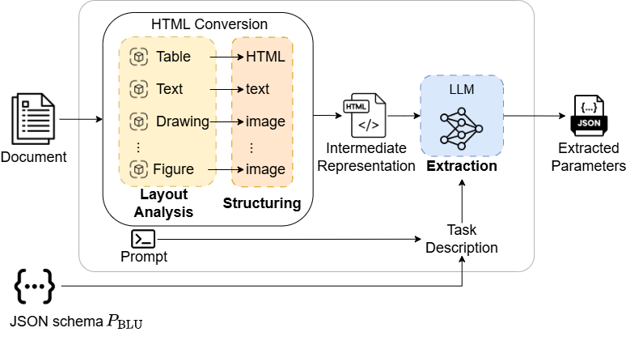

# Towards Automated Parameter Extraction from Datasets

This repository contains the code for the article **"Towards Automated Parameter Extraction from Datasets."** The project focuses on developing methods for automated parameter extraction from complex documents, utilizing a two-step extraction approach.

The extraction method is continuously developed as a python package that can be found here: https://github.com/Novia-RDI-Seafaring/MERI/tree/main

## Abstract
The digitalization of smart manufacturing processes relies on extracting information from engineering documents. These documents often exhibit complex heterogeneous layouts that machines struggle to interpret. Recent AI developments may change this. We set out to evaluate the readiness of AI-based approaches for extracting information from engineering documents. In this work, we propose a general framework (MERI) for information extraction and evaluate it on a synthetic dataset explicitly created to evaluate parameter extraction from engineering documents. We find that converting documents into a machine-friendly intermediate format improves the performance of information extraction methods. However, further improvements are necessary before AI systems can extract parameters reliably.



## Installation and Setup

To set up the environment, it is recommended to use Docker for an easier installation process. The repository includes a `devcontainer.json` and a `Dockerfile` for this purpose.

### Installation Steps
1. Install the MERI package:
   ```bash
   pip install -e ./meri
   ```
2. Install the MERI Evaluation package:
   ```bash
   pip install -e ./meri_evaluation
   ```

### Environment Configuration
- Create an environment file to store your API keys for the LLM. Current implementation supports Azure and Open Ai as LLM providers. However, we use **litellm** so it can be easily extended to other providers. For example, if you are using Azure LLM, set the following environment variables:
  ```bash
  AZURE_API_KEY=<your_api_key>
  AZURE_API_BASE=<your_api_base>
  ```

### Dataset Generation
- In the article we propose a synthetic pdf generation framework to evaluate parameter extraction methods. This is utilized for the evaluation, code can be found here: https://github.com/NoviaIntSysGroup/syn-doc-gen

## Experiments Configuration
- A small dummy dataset is provided in the `data/example` directory.
- Configuration files can be placed in the `configs` directory. An example configuration might look like this:

```yaml
dataset_path: "path/to/dataset"
res_dir: "path/to/result" # stores pickle results in this dir
cache_dir: "path/to/cache" # caches extracted parameters in this dir

methods_to_run:

  - method: DOCLING # MERI with Docling (2-step approach)
    id: meri_gpt4o
    kwargs:
      extractor_kwargs:
        chunks_max_characters: 450000
        chunk_overlap: 1
        n_rounds: 1
        model: 'azure/gpt-4o'
        model_temp: 0.0
      docling_kwargs:
        do_ocr: true

  - method: VANILLA_LLM
    id: GPT4o # baseline 1-step approach
    kwargs: 
      model: GPT4o
      prompt_key: VANILLA_LLM_PROMPT
      text_mode: ocr_text
      model_temp: 0.0
```

## Running the Evaluation

To start the evaluation, run the following command:
```bash
python scripts/run_evaluation.py --config_file_path scripts/configs/config_example.yaml
```

Results and cache will be stored in the directories specified in the config file.

## Acknowledgments
This work was done in the Business Finland funded project [Virtual Sea Trial](https://virtualseatrial.fi/).